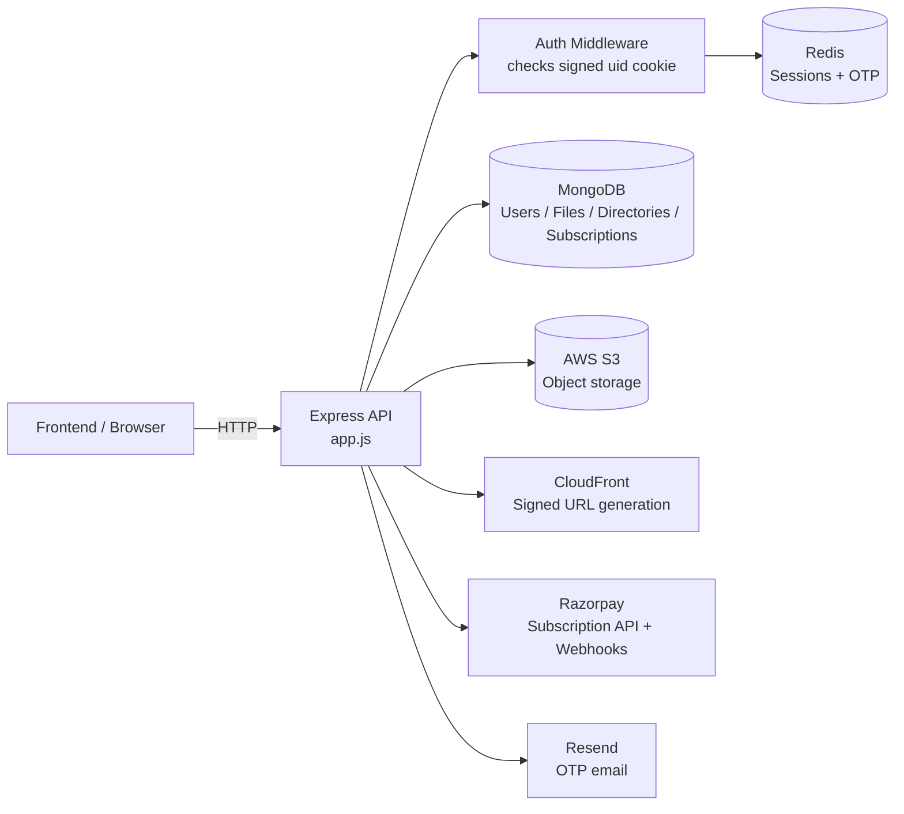

# StorVault Backend

StorVault is a cloud-storage backend that manages user accounts, storage quotas, folders, file metadata, public sharing, and subscription-based plan upgrades. This repository contains the backend API and server-side logic that powers the StorVault client application.

The backend is built with Express and Node.js, stores user and file metadata in MongoDB, keeps transient session and OTP data in Redis, and uses AWS S3 plus CloudFront for object storage and signed file access.

## 1. Overview

StorVault is a backend for a file-storage application where users can register, create folders, upload files, preview/download files, share links, and manage storage limits. The main purpose of this repository is to provide the API layer that authenticates users, enforces storage quotas, handles file metadata and directory structure, and integrates with cloud storage and payment services.

This backend is responsible for:

- user registration and login flows
- session management and access control
- directory and file lifecycle operations
- S3 presigned upload/download flows
- public file sharing
- storage usage tracking and quota enforcement
- Razorpay subscription creation and webhook handling
- admin user management

## 2. Key Features

- Email/password registration with OTP verification via email
- Login and logout with signed, HTTP-only cookies backed by Redis session records
- Google OAuth sign-in using Google ID token verification
- User root directory creation on registration
- Hierarchical folder management with nested directory traversal
- File upload initiation and completion using S3 presigned URLs
- File metadata tracking in MongoDB with size and quota accounting
- File preview and download links generated with CloudFront signed URLs
- Public file share links with token-based access
- Shared-with-me and shared-with user file views
- Storage limits and usage tracking per user
- Role-based access control for Admin and Manager users
- Admin endpoints for listing users, forcing logouts, deactivating users, and role changes
- Razorpay subscription creation and webhook-validated plan activation
- Dockerized backend deployment and EC2 deployment pipeline

## 3. Tech Stack

| Category                 | Technologies                                                                 |
| ------------------------ | ---------------------------------------------------------------------------- |
| Runtime / Framework      | Node.js, Express.js, ES Modules (`type: "module"`), CORS, cookie-parser, Zod |
| Database                 | MongoDB, Mongoose                                                            |
| Authentication / Session | Redis sessions, signed cookies, Google OAuth, bcrypt, Resend email OTP       |
| Cloud / Storage          | AWS S3, AWS SDK v3, CloudFront signed URLs                                   |
| Payments                 | Razorpay SDK and webhook validation                                          |
| DevOps / Deployment      | Docker, Docker Compose, GitHub Actions, Docker Hub, EC2 via SSH              |
| Other                    | Redis, Resend client, Google Auth Library                                    |

### Runtime / Framework

- Node.js 22 is used in the Docker image
- Express.js handles the REST API surface
- `cookie-parser` is configured with `COOKIE_SIGNER`
- CORS is restricted to a small allowlist of frontend origins
- `zod` validates registration/login/OTP input payloads

### Database

- MongoDB is connected through `server/config/mongoose.js`
- The application uses Mongoose models for `User`, `Directory`, `File`, and `Subscription`
- The DB name is set to `storageApp`

### Authentication / Session Management

- Email/password login is backed by `bcrypt` password hashing and verification
- Registration requires an OTP sent to the user email using Resend
- Sessions are stored in Redis as JSON values keyed by `session:<uuid>`
- The `uid` cookie is set as an HTTP-only, signed cookie for session tracking
- Google sign-in uses `google-auth-library` with `verifyIdToken`
- `authMiddleware.js` reads the signed cookie, loads the Redis session, and populates `req.user`

### Cloud / Storage

- AWS S3 is used for file storage
- Presigned URLs are created for uploads and downloads using AWS SDK v3
- CloudFront signed URLs are used for file preview/download access
- File metadata is tracked in MongoDB while object blobs reside in S3

### Payments

- Razorpay subscriptions are created through the SDK
- Webhooks are validated using `Razorpay.validateWebhookSignature`
- Subscription plan metadata is mapped in `PLANS` with storage quotas

### DevOps / Deployment

- `server/Dockerfile` builds the API in a Node 22 Alpine image
- `server/docker-compose.yml` runs the backend using a Docker image and `.env`
- GitHub Actions builds a Docker image and deploys it to EC2 over SSH

## 4. System Architecture

The backend is organized around a lightweight Express API in front of MongoDB, Redis, S3, and Razorpay.

- The main entry point is `server/app.js`
- API routes are grouped by domain: user auth, directory management, file management, sharing, subscription, admin, and webhooks
- `authMiddleware` validates the signed session cookie and resolves the user from Redis
- MongoDB stores persistent entities such as users, file metadata, directories, and subscription records
- Redis stores short-lived OTP data and active user sessions
- S3 stores uploaded objects; the backend generates signed URLs instead of proxying file streams
- CloudFront signed URLs are returned to clients for preview/download access
- Razorpay webhooks update the subscription status and user quota after payment activation



### Request flow

1. The client authenticates with `/user/login`, `/user/register`, or `/user/google`.
2. The backend creates a Redis-backed session and sets a signed `uid` cookie.
3. For file uploads, the client calls `/file/upload/initiate` and receives a presigned S3 URL.
4. The object is uploaded directly to S3.
5. The client calls `/file/upload/complete`, and the backend verifies the uploaded object metadata, updates storage usage, and saves file metadata in MongoDB.
6. File preview/download requests return CloudFront signed links rather than streaming through the API server.

## 5. Authentication & Session Management

The backend uses a custom cookie-based session model rather than JWTs.

### Registration and login

- `POST /user/register` validates the payload and sends a one-time password to the user email.
- `POST /user/verify-otp` checks the OTP stored in Redis and creates the user and initial root directory in MongoDB.
- `POST /user/login` validates the password, creates a Redis session record, and sets a signed, HTTP-only cookie named `uid`.

### Cookie behavior

In `server/app.js`, the app uses:

```js
app.use(cookieParser(process.env.COOKIE_SIGNER));
```

The session cookie is created with:

- `httpOnly: true`
- `signed: true`
- `secure: true` in the standard login flow
- `sameSite: "none"`
- `maxAge: 7 days`

This means the API relies on signed browser cookies for identity, not bearer tokens.

### Redis-backed sessions

`authMiddleware.js` reads `req.signedCookies.uid`, then looks up a session in Redis at `session:<uid>`. Session data includes:

- user `_id`
- email
- role
- root directory ID
- name

If the session is missing or expired, the request is rejected with `401`.

### Google OAuth

`POST /user/google` verifies a Google ID token with `google-auth-library` using `GOOGLE_CLIENT_ID`.

- If the user already exists, the session is created for that user.
- If the user does not exist, a new MongoDB user and root directory are created.
- The same signed cookie flow is used after successful Google verification.

### Logout

- `POST /user/logout` deletes the Redis session and clears the `uid` cookie.
- `POST /user/logout-all` is also defined in the router and calls session cleanup logic in the codebase.

## 6. File Upload & Download Architecture

### Upload flow

The upload path is intentionally split into two steps:

1. `POST /file/upload/initiate`

   - validates the parent directory and requested file size
   - checks the user’s current `storageUsed` against `maxStorageLimit`
   - creates a MongoDB file record with `isUploading: true`
   - creates a presigned S3 upload URL using `createUploadSignedUrl`

2. `POST /file/upload/complete`
   - reads the uploaded object metadata from S3 via `HeadObjectCommand`
   - verifies that `ContentLength` matches the tracked file size
   - marks the file as uploaded
   - increments the user’s storage usage and the directory’s size

This design avoids streaming the entire file through the Express server and keeps uploads direct to S3.

### Download and preview

- `GET /file/:id` accepts `?action=download` or `?action=preview`
- It resolves the file record in MongoDB
- It creates a CloudFront signed URL based on the S3 object key
- For downloads, the response is a redirect to the signed URL
- For previews, the API returns the signed URL and metadata to the client

### Public sharing

- `POST /user/share/public` creates a public share token and stores it on the file document
- `GET /share/:token` serves the shared file through a signed CloudFront URL
- `PATCH /user/share/public/revoke` disables the public share

### Why direct-to-S3 uploads are used

The code explicitly generates presigned upload URLs and stores only metadata in MongoDB. This architecture is used to:

- reduce server memory usage for larger uploads
- keep the API resilient to large file transfers
- leverage S3 for object storage while MongoDB remains the record source of truth

## 7. Authorization / RBAC

The application defines three roles in `server/models/userModel.js`:

- `User`
- `Manager`
- `Admin`

Role enforcement is implemented in `server/middlewares/roleMiddleware.js`:

```js
if (!allowedRoles.includes(req.user.role)) {
  return res.status(403).json({ message: "Access denied" });
}
```

### Actual admin access patterns

- `GET /admin/users` is allowed for `Admin` and `Manager`
- `POST /admin/users/:userId/logout` is allowed for `Admin` and `Manager`
- `PATCH /admin/users/:id/deactivate` is allowed for `Admin` and `Manager`
- `PATCH /admin/users/:id/change-role` is allowed for `Admin` and `Manager`
- `DELETE /admin/users/:id/delete` is restricted to `Admin`

Normal users are authenticated via `checkAuth`, but they do not have access to admin-protected routes.

## 8. File & Folder Management

The backend manages a user-specific storage tree built from MongoDB documents.

### Directories

- Each user has a root directory created during registration
- Nested directories are supported through `parentDirId`
- `GET /directory/:id?` returns a directory payload with nested files and subdirectories
- `POST /directory/:parentDirId?` creates a directory inside the requested parent directory
- `PATCH /directory/:id` renames a directory
- `DELETE /directory/:id` removes the directory and recursively deletes nested items and their S3 objects

### Files

- `POST /file/upload/initiate` creates a file record before upload
- `POST /file/upload/complete` finalizes the object and updates quota counters
- `GET /file/:id` returns access metadata and a preview/download URL
- `PATCH /file/:id` renames a file
- `DELETE /file/:id` removes the object from S3 and the file record from MongoDB

### Storage quotas

The `User` model includes:

- `storageUsed`
- `maxStorageLimit`
- default `maxStorageLimit` is `256 * 1024 * 1024`

The backend checks these values before uploads and updates them after completion or deletion.

### Sharing

The `File` model supports:

- `sharedWith: [{ userId, permission }]`
- `publicShare: { enabled, token, permission, expiresAt }`

The code implements file sharing to specific users and public share link generation.

## 9. Payments / Subscriptions

The backend includes a Razorpay subscription flow.

### Subscription creation

`POST /subscription` calls `createSubscription` and creates a Razorpay subscription with:

- `plan_id`
- `total_count: 12`
- a `notes.userId` field

The created subscription is saved in MongoDB under the `Subscription` model.

### Plan quotas

The `PLANS` map in `server/controllers/webhookController.js` defines storage limits for several Razorpay plan IDs:

- monthly starter: 500 MB
- monthly pro: 2 GB
- yearly starter: 500 MB
- yearly pro: 2 GB

When a Razorpay webhook arrives, the server validates the signature and updates the user’s `maxStorageLimit` if the event is `subscription.activated`.

### Webhook security

The webhook handler uses:

```js
Razorpay.validateWebhookSignature(
  req.body.toString(),
  signature,
  process.env.RAZORPAY_WEBHOOK_KEY,
);
```

This ensures only valid Razorpay webhook requests are processed.

## 10. API Documentation

This backend exposes a REST API with the following major route groups.

### Authentication

| Method | Route              | Purpose                                    | Auth |
| ------ | ------------------ | ------------------------------------------ | ---- |
| POST   | `/user/register`   | Register a user and send OTP               | No   |
| POST   | `/user/verify-otp` | Verify registration OTP and create account | No   |
| POST   | `/user/login`      | Email/password login                       | No   |
| POST   | `/user/google`     | Google OAuth login                         | No   |
| GET    | `/user/`           | Fetch current user profile                 | Yes  |
| POST   | `/user/logout`     | Log out current user                       | Yes  |
| POST   | `/user/logout-all` | Route exists for broader session cleanup   | Yes  |
| GET    | `/user/users`      | Search non-admin users by email            | Yes  |

### User & Sharing

| Method | Route                        | Purpose                                 | Auth |
| ------ | ---------------------------- | --------------------------------------- | ---- |
| POST   | `/user/share`                | Share a file with targeted users        | Yes  |
| GET    | `/user/share/me`             | List files shared with the current user | Yes  |
| POST   | `/user/share/public`         | Create public share link                | Yes  |
| GET    | `/user/share/public/:fileId` | Get public-share metadata for a file    | Yes  |
| PATCH  | `/user/share/public/revoke`  | Disable public share                    | Yes  |
| GET    | `/share/:token`              | Publicly access a shared file           | No   |

### Files

| Method | Route                   | Purpose                                           | Auth |
| ------ | ----------------------- | ------------------------------------------------- | ---- |
| POST   | `/file/upload/initiate` | Create file record and generate S3 presigned URL  | Yes  |
| POST   | `/file/upload/complete` | Finalize upload and update storage counters       | Yes  |
| GET    | `/file/:id`             | Get file metadata and preview/download signed URL | Yes  |
| PATCH  | `/file/:id`             | Rename a file                                     | Yes  |
| DELETE | `/file/:id`             | Delete a file and remove S3 object                | Yes  |

### Folders

| Method | Route                      | Purpose                                | Auth |
| ------ | -------------------------- | -------------------------------------- | ---- |
| GET    | `/directory/:id?`          | Get a directory and its files/folders  | Yes  |
| POST   | `/directory/:parentDirId?` | Create a directory                     | Yes  |
| PATCH  | `/directory/:id`           | Rename a directory                     | Yes  |
| DELETE | `/directory/:id`           | Delete a directory and nested contents | Yes  |

### Subscriptions

| Method | Route                | Purpose                                                   | Auth                     |
| ------ | -------------------- | --------------------------------------------------------- | ------------------------ |
| POST   | `/subscription`      | Create a Razorpay subscription for the authenticated user | Yes                      |
| POST   | `/webhooks/razorpay` | Razorpay subscription webhook endpoint                    | No (signature validated) |

### Admin / Management

| Method | Route                          | Purpose                                    | Auth                |
| ------ | ------------------------------ | ------------------------------------------ | ------------------- |
| GET    | `/admin/users`                 | List user records and active session state | Yes + Admin/Manager |
| POST   | `/admin/users/:userId/logout`  | Force a user logout across sessions        | Yes + Admin/Manager |
| DELETE | `/admin/users/:id/delete`      | Delete a user and associated records       | Yes + Admin         |
| PATCH  | `/admin/users/:id/deactivate`  | Deactivate a user account                  | Yes + Admin/Manager |
| PATCH  | `/admin/users/:id/change-role` | Update a user role                         | Yes + Admin/Manager |

### Utility / diagnostics

| Method | Route | Purpose                | Auth |
| ------ | ----- | ---------------------- | ---- |
| GET    | `/`   | Root health/demo route | No   |

## 11. Project Structure

```text
StorVault Backend
├── server/
│   ├── .github/
│   │   └── workflows/
│   │       └── deploy.yml
│   ├── config/
│   │   ├── mongoose.js
│   │   ├── redis.js
│   │   ├── s3.js
│   │   └── setup.js
│   ├── controllers/
│   │   ├── adminController.js
│   │   ├── directoryController.js
│   │   ├── fileController.js
│   │   ├── subsciptionContoller.js
│   │   ├── userController.js
│   │   └── webhookController.js
│   ├── middlewares/
│   │   ├── authMiddleware.js
│   │   ├── roleMiddleware.js
│   │   └── validateIdMiddleware.js
│   ├── models/
│   │   ├── directoryModel.js
│   │   ├── fileModel.js
│   │   ├── subscriptionModel.js
│   │   └── userModel.js
│   ├── routes/
│   │   ├── adminRoutes.js
│   │   ├── directoryRoutes.js
│   │   ├── fileRoutes.js
│   │   ├── shareRoutes.js
│   │   ├── subscriptionRoute.js
│   │   ├── userRoutes.js
│   │   └── webhookRoutes.js
│   ├── services/
│   │   └── cloudfront.js
│   ├── utils/
│   │   ├── cleanUserSession.js
│   │   ├── googleAuthService.js
│   │   ├── mailer.js
│   │   └── sendOtpMail.js
│   ├── validators/
│   │   └── authSchema.js
│   ├── app.js
│   ├── Dockerfile
│   ├── docker-compose.yml
│   ├── package.json
│   └── README.md

```

### Important directories

- `config/` contains database, Redis, and S3 connection and setup code
- `controllers/` contains the core business logic for auth, files, admin, and subscriptions
- `middlewares/` contains authentication, authorization, and validation code
- `models/` define the MongoDB schemas
- `routes/` map HTTP endpoints to controllers
- `services/` contains the CloudFront signed URL helper
- `utils/` contains email and Google auth helpers

> The root-level PEM files exist in the workspace, but the backend code reads the CloudFront key material from environment variables rather than directly from these files.

## 12. Environment Variables

The backend expects the following environment variable names to be present:

```text
MONGO_URI
COOKIE_SIGNER
CLIENT_URL_1
CLIENT_URL_2
REDIS_URL
REDIS_PASSWORD
AWS_ACCESSKEY_ID
AWS_SECRET_ACCESS_KEY
AWS_BUCKET
AWS_KEY_PAIR_ID
CLOUDFRONT_PRIVATE_KEY
CLOUDDRONT_DISTRIBUTION_DOOMAIN
RAZORPAY_KEYID
RAZORPAY_KEYSECRET
RAZORPAY_WEBHOOK_KEY
GOOGLE_CLIENT_ID
RESEND_API_KEY
```

No `.env.example` file is present in this repository, so these variables need to be defined in a local `.env` file or in the deployment environment.

## 13. Local Development

### Prerequisites

- Node.js 22 or compatible version
- MongoDB instance reachable via `MONGO_URI`
- Redis instance reachable via `REDIS_URL` and `REDIS_PASSWORD`
- AWS S3 access and CloudFront configuration
- Razorpay credentials and webhook key
- Google OAuth client ID
- Resend API key for OTP emails

### Setup

```bash
cd server
npm install
```

Create a `.env` file in `server/` with the required environment variable names listed above.

### Start the server

```bash
npm run dev
```

or

```bash
npm start
```

The application listens on port `4000`.

### Available scripts

From `server/package.json`:

```json
"scripts": {
  "dev": "nodemon app.js",
  "start": "node app.js",
  "build": "node build.js"
}
```

## 14. Docker

The project includes a Docker setup for the backend.

### Dockerfile

`server/Dockerfile` uses the official Node 22 Alpine image:

```dockerfile
FROM node:22-alpine
WORKDIR /app
COPY package*.json ./
RUN npm ci
COPY . .
EXPOSE 4000
CMD ["npm", "start"]
```

### Docker Compose

`server/docker-compose.yml` defines a single service named `backend`:

```yaml
services:
  backend:
    image: abdurrahmancodes/storage-backend:latest
    container_name: storage-backend
    ports:
      - "4000:4000"
    env_file:
      - .env
    restart: unless-stopped
```

To run locally with Docker:

```bash
cd server
docker compose up --build
```

## 15. Deployment

The repository includes a GitHub Actions deployment workflow in `server/.github/workflows/deploy.yml`.

The pipeline:

1. checks out the repo
2. logs in to Docker Hub
3. builds and pushes a Docker image
4. SSHs into an EC2 instance
5. pulls the latest compose stack and restarts the backend container

This confirms the project is configured for Docker Hub image publishing and EC2-based deployment.

## 16. Security Considerations

The backend includes several actual security controls:

- signed, HTTP-only cookies for session tracking
- Redis-backed session validation in `authMiddleware`
- user role authorization via `authorizeRoles`
- validation with Zod for auth-related inputs
- MongoDB ObjectId validation in `validateIdMiddleware`
- CORS allowlist with explicit origin checking
- Razorpay webhook signature verification
- presigned S3 URLs for uploads and downloads
- CloudFront signed URLs for file access
- secure cookie settings in the login flow

## 17. Frontend Repository

A dedicated frontend repository is present in the workspace under `client/`, but the exact external GitHub URL is not declared in this backend repository.

Frontend repository link: placeholder to be added when the public repository URL is known.

## 18. Live Demo

The code references the live client domain in environment variables as:

- `https://storvault.xyz`
- `https://www.storvault.xyz`

Live demo: https://storvault.xyz


## Summary

This backend provides the core storage, authentication, and subscription logic for StorVault. It is designed around a secure session model, direct-to-S3 uploads, CloudFront protected downloads, MongoDB metadata persistence, and Razorpay-driven plan management. The implementation is straightforward and service-oriented, with the server acting as the API layer and policy enforcement layer while the cloud services handle object storage and signed access.
